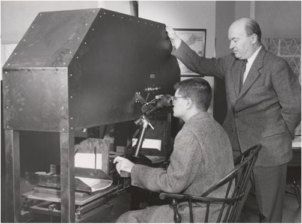

<!-- @import "[TOC]" {cmd="toc" depthFrom=1 depthTo=6 orderedList=false} -->
<!-- code_chunk_output -->

* [Friday, 5 July 2019](#friday-5-july-2019)
	* [Aims](#aims)
		* [Seminar 12: Problems with TEI; computer-assisted collation; alternative markup with LMNL](#seminar-12-problems-with-tei-computer-assisted-collation-alternative-markup-with-lmnl)
			* [Reading](#reading)
			* [Computer-Assisted Collation](#computer-assisted-collation)
			* [Juxta Commons Exercise](#juxta-commons-exercise)
			* [CollateX](#collatex)
		* [Seminar 13: Publishing Options](#seminar-13-publishing-options)
			* [Lecture notes](#lecture-notes)
			* [How to publish](#how-to-publish)

<!-- /code_chunk_output -->

# Friday, 5 July 2019

## Aims

- Familiarity with some drawbacks of TEI, and an understanding of alternative markup options.

- Ability to perform electronic collation.

- A basic understanding of the options for publishing xml documents.


Time     | Topic                               | Type                    |
:--------| :---------------------------------- |:------------------------|
9.30 | Seminar 12: Problems with TEI; computer-assisted collation overview | Presentation, discussion |
11.30 | Seminar 13: Publishing digital editions; course review | Discussion |

### Seminar 12: Problems with TEI; computer-assisted collation; alternative markup with LMNL

#### Reading

1. [Wendell Piez, "TEI in LMNL: Implications for Modeling"](https://journals.openedition.org/jtei/1337) (*jTEI*, 2014)

If you were to encode a poem like Edward Thomas's "Child of the Cliffs" (download [here](../edward-thomas-child)) you might want to start encoding linguistic phenomena.

Say we would like to mark up all instances of speakers and phrases with `<q>` ([quotation](https://tei-c.org/release/doc/tei-p5-doc/en/html/ref-q.html)), `<phr>` ([phrase](https://www.tei-c.org/release/doc/tei-p5-doc/en/html/ref-phr.html)), and `<s>` ([sentence](https://tei-c.org/release/doc/tei-p5-doc/en/html/ref-s.html)) tags.

What happens to the XML validation?

*An alternative markup:* **LMNL**. LMNL (the Layered Markup and Annotation Language) is a non-hierarchical markup language developed by Wendell Piez.

The document consists of text and a sequence of atoms (mostly characters) with ranges (subsequences) applied to the text. Atoms and ranges may be named and annotated just like xml elements. Text ranges may or may not correspond to each other: the text retains tag types but loses the well-formedness rules of xml. This gives you the ability to retain many of the structural features of xml but with overlapping hierarchies. Therefore, Piez designed LMNL so that it could be implemented with XML.

Alternative markups such as LMNL are best used when the the XML or TEI-XML cannot serve the project's purposes. It is also best to only use alternative markup on small- to medium-scale projects (LMNL, for example, does not provide validation rules like XML does).

**Exercise 1**

Mark up the Tennyson poem in LMNL and make sure to encode the speakers (and any other features) you may find interesting.

How does that compare to TEI encoding?

What you are doing with LMNL can also be done in TEI with what is called Trojan Horse markup. This is the use of empty elements (with pointing mechanisms) to tie to kinds of overlapping elements together.

In the Thomas poem, you'll notice right away that you cannot properly encode a simple quotation across the last two line elements here, but you also cross line elements when you encode phrases and sentences.

```
<lg type="sestet">
               <l>Fishes and gulls ring no bells. There cannot be</l>
               <l>A chapel or church between here and Devon,</l>
               <l>With fishes or gulls ringing its bell,—hark!—</l>
               <l>Somewhere under the sea or up in heaven.</l>
               <l>“It’s the bell, my son, out in the bay</l>
               <l>On the buoy. It does sound sweet to-day.”</l>
            </lg>
```

How to get around this?

#### Computer-Assisted Collation

The traditional method of collation has been tedious: you literally read versions of texts side-by-side and note the differences in a collation table.

The Hinman collator at work.



In most cases, machine-collation can detect differences that human eyes often miss: punctuation differences, capitalization, even entire lines of text. Two very effective methods of machine-collation can be achieved with Juxta and Collatex. Juxta is easier to use, and quite effective, but it lacks flexibility, and some texts require a lot more nuanced treatment. For more bespoke text projects with a lot of textual variation, Collatex is an option, but it involves a learning curve. It is faster and fully customizable, yet it lacks the accessible interface of Juxta. Like any other editorial project, your decision of what to use depends on your documents, and how you would like to present those documents.

#### Juxta Commons Exercise

Juxta Commons is a web-based interface for comparing versions of texts and creating editions from those versions.

<strong>Instructions</strong>

* Go to [Juxta Commons](http://www.juxtacommons.org/) (http://www.juxtacommons.org/)
* Create a [free account](http://www.juxtacommons.org/signup)
(http://www.juxtacommons.org/signup)
* Download the two versions of Mark Twain's "A Scrap of Curious History"
  * [Holograph manuscript transcription (c. 1894)](../readings/a-scrap-of-curious-history-ms.txt)
  * [1914 published text](../readings/a-scrap-of-curious-history-harpers-1914.txt)

If you already have some versions of a text prepared, feel free to use those.
* Click on "Add Source" (top-left of the screen) and upload the files you just downloaded.
* When you have uploaded your sources, under "Sources" click on the right arrow ("Prepare Witness"). The source will then appear in the top-middle pane, "Witnesses."
* Select the witnesses that you would like to compare by clicking on the box next to its title and then "Create set" (you will then select "Create with Witnesses").
* Add the appropriate metadata to the set, then click "Create and collate".

A good example of an edition using Juxta: The [Fluid Text edition of Herman Melville's *Moby-Dick*](https://mel.hofstra.edu/expurgating-moby-dick.html).

For a more detailed user guide, go to <http://www.juxtacommons.org/guide?nocontrols#screencast>.

#### CollateX

Download Python 3, preferably the Anaconda distribution

* pip install --pre collatex
* pip install python-levenshtein (but see the note below for Windows)
* pip install graphviz (either through a package manager such as apt-get or MacPorts, or go to http://www.graphviz.org/Download.php and accept the license)
* pip install graphviz

If these instructions do not make sense, consult [David Birnbaum's site](http://collatex.obdurodon.org/installation.xhtml).

A good example of a Collatex collation: the [Samuel Beckett manuscript project](www.beckettarchive.org/).

### Seminar 13: Publishing Options

#### Lecture notes

* A finished TEI XML file can be published in several ways.
    * Share the source document.
    * Convert the source file into a reading format (HTML, PDF, ePub), either online or in print.
    * Make *all* the data accessible online (XML, XSLT, CSS, and other code).

* Remember that "publishing" means both distribution and discovery. For the digital editor that means using acceptable file formats that people (not just publishers) can use.

* In digital scholarly editing, publishing can be almost immediate, but it can also mean several different outputs.
1. Share in an online code repository (easiest):
    * Gains: quick, easy, free or low cost for hosting, allows for reuse of your work.
    * Losses: no interface (not reader-friendly), no way to customise the reading experience (you get *all* the data), so it lacks in the design qualities that we expect from editions.
2. Create new (or modify existing) XSLT files to transform your edition data into web-friendly HTML files that you can host on a server.
    * Gains: fairly straightforward (if you know a little XSLT)
    * Losses: you need to learn XSLT, need to host it (or otherwise distribute it), it is (usually) a static resource; if the TEI is changed in any way you will need to re-run the transformation and distribute it again.
3. Use an out-of-the-box tool to publish your project.

#### How to publish

1. **[Ed](https://elotroalex.github.io/ed/)**
    * Best for: quick and easy reading texts of editions based on Markdown / minimal computing.
    * Features:
    Focused on legibility, durability, ease and flexibility
    Static (low cost) hosting through Jekyll application
2. **[TEI Boilerplate](http://dcl.slis.indiana.edu/teibp/)**
    * Best for: getting up and running quickly
    * Features:
In-browser conversion from TEI to HTML
Links, images, etc.
Works in all major browsers
Good for small simple projects
Customizable with CSS
Viewing page-source reveals TEI

3. **[TEI Critical Apparatus Toolbox](http://teicat.huma-num.fr/)**
    * Best for: testing
    * Features:
Based on the TEI Boilerplate
Checks encoding while unfinished
Displays parallel versions
Prints the edition
Provides basic statistics

4. **[Juxta commons](http://juxtacommons.org/)**
    * Best for comparing witnesses
5. **[TAPAS](http://www.tapasproject.org/)**
    * Best for sharing
    * TEI Archiving, Publishing and Access
Service
Free accounts can contribute to existing
projects and collections
Paid (or TEI) members have free storage
and possibility of creating projects and
collections
Uses XSLT transformations to display TEI

6. **[TEI Publisher](http://teipublisher.com/exist/apps/tei-publisher-home/index.html)**
    * Best for an out-of-the-box solution
    * Based on eXist-db database
Provides easy browsing and
search of TEI documents
Default view is clean, simple
but elegant
Control of display is through
ODD processing format
7. **Bespoke online resource**
    * Gains: Highly customisable, takes full advantage of your rich XML, presents multiple views based on your data, includes many related resources.
    * Losses: time and skill intensive.
